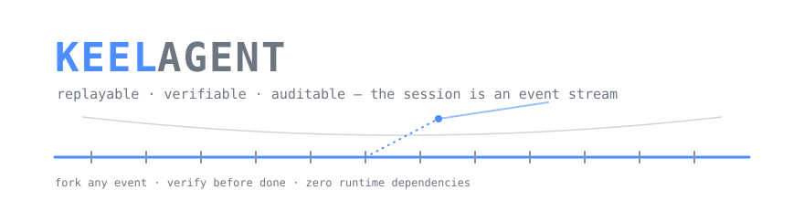

<div align="center">



**可回放、可验证、可审计的编码智能体 CLI。**

事件溯源会话 · 证据驱动完成 · 零运行时依赖

[English](./README.md) · **中文**


</div>

---

Keel 是一个把**会话当作只追加事件日志**、把**"完成"当作可验证契约**的 coding agent harness。OpenAI 兼容接口通吃 DeepSeek / GLM / Kimi / Qwen / OpenAI，零运行时依赖安装，退出码可被 CI 直接依赖。

```
keel run "修复登录超时的 bug，并确保测试通过"
```

## 为什么再做一个 agent CLI

到 2026 年，agent CLI 的功能清单已经同质化：工具循环、MCP、hooks、插件、子代理家家都有。Keel 不在清单上竞争，而是改 harness 的三个核心行为。

### 1. 会话即事件流（event-sourced session）

传统 agent 把对话存成消息数组，"恢复会话"只是续上数组。Keel 的会话是一条 **append-only 事件流**（`~/.keel/sessions/<id>/events.jsonl`），LLM 请求/响应、策略判定、工具调用、验证证据、上下文压缩全部是带序号的事件；对话历史、花费、验证状态全部是对事件的 **fold（纯推导）**，不存在第二份事实。

由此获得消息数组模型表达不了的能力：

- **`keel fork <id> --at <seq>`**：从任意事件分叉出新会话——"如果它当时没删那个文件会怎样"是可操作的实验
- **`keel replay <id>`**：只读回放完整执行轨迹（含每步策略判定与成本）
- **`keel cost <id>`**：按模型/回合的费用审计，精确到每次 LLM 调用
- **`plan` 规划工具**：计划也是事件——每次更新落进事件流，回放可见计划的演变，fork 后计划状态随之回溯
- **上下文压缩只是视图替换**：事件流里永远有全量历史，fork 回压缩点即可还原——不像传统 compact，压完细节就永久丢失

### 2. 证据驱动的完成契约（evidence-driven done）

别的 agent 说"完成"是模型自述。Keel 由 **harness 强制**：只要发生过文件修改（write/edit），模型声明完成前必须调用 `verify` 工具跑通验证（测试/构建/脚本），证据落盘 `evidence/` 目录；没验证就想收工会被打回（最多 2 次），最终仍无证据则以 `unverified` 结束并给出**非零退出码**——CI 里可以直接依赖这个信号。

### 3. 策略先行、全程审计

所有工具调用先过声明式策略引擎再执行，判定本身也作为事件落盘：

- `denyPaths`：路径黑名单（默认 `.env`、私钥），**读和写都拦**
- `bashDeny` / `bashApprove`：命令直接拒绝 / 需人工确认
- `readOnly`：只读模式
- 预算熔断：会话花费超上限自动停

## 和同类工具的对比

| | Keel | Claude Code | Codex CLI | Apache Maka |
|---|---|---|---|---|
| 会话模型 | 只追加事件日志，状态 = fold | 消息数组 + checkpoint 回滚 | rollout 记录 | RuntimeEvent 日志 + 投影 |
| 任意事件点分叉 | ✅ `fork --at <seq>` | 仅回滚（丢弃后续） | — | 仅 resume |
| 压缩可逆 | ✅ 视图替换，历史保留 | ✗ `/compact` 后细节丢失 | ✗ auto-compact 后丢失 | ✅ 离开 prompt 不离开日志 |
| "完成"机器可验证 | ✅ verify 门禁 + 退出码 | ✗ | ✗ | ✗（eval 度量 harness 自身） |
| 模型绑定 | 任意 OpenAI 兼容端点 | Anthropic | OpenAI 生态 | 自带模型 |
| 运行时依赖 | **0** | — | — | 大型工作台应用 |

Keel 不和别人拼功能清单。它是为 CI 与自动化准备的最小可信 harness：像 git 一样可分叉、像账本一样可对账、对"完成"诚实。

## 快速开始

```bash
git clone https://github.com/dangzitou/keel-agent.git
cd keel-agent && npm install && npm run build
export ZHIPU_API_KEY=sk-...   # 或 STEPFUN_API_KEY / DEEPSEEK_API_KEY 等
node dist/index.js            # 交互式 REPL——模型根据你 export 的 key 自动匹配
```

零配置文件：环境里有哪些 provider 的 key，keel 就自动选合理的默认模型。`node dist/index.js run "任务"` 单发模式、`continue` 继续最近会话、`-m <provider/model>` 临时换模型。

没有 API key 也能体验完整链路（确定性 mock 模型）：

```bash
KEEL_MOCK=1 node dist/index.js run "写个 hello"
```

## CLI

| 命令 | 作用 |
|---|---|
| `keel` | 交互式 REPL（`--session <id>` 继续会话） |
| `keel continue` | 继续最近一个会话 |
| `keel run "<任务>"` | 单任务模式；`unverified` 时退出码 3，失败退出码 1（`-m <ref>` 换模型，`--yes` 自动放行审批） |
| `keel sessions` | 列出会话（回合数、花费、⚠未验证修改标记） |
| `keel replay <id>` | 只读回放事件流 |
| `keel fork <id> [--at <seq>]` | 从第 seq 个事件分叉新会话 |
| `keel cost <id>` | 成本报告 |
| `keel doctor` | 环境体检：node 版本、配置、密钥、价目、验证命令、目录可写性 |
| `keel init` | 生成配置模板 |

REPL 内命令：`/help /new /sessions /replay /fork /cost /policy /exit`。

**退出码约定**（给 CI 用）：`0` done · `1` 失败/预算/超轮次 · `3` 存在未验证修改 · `130` 被中断。

**可靠性设计**：LLM 调用对 429/5xx/网络错误做指数退避重试（`llm.retries`，尊重 `Retry-After`），单请求超时可配（`llm.timeoutMs`）；每次重试落 `llm.retry` 事件可审计。Ctrl+C 触发 AbortSignal 全程传导——进行中的 fetch 与 bash 进程组被终止，`turn.completed(aborted)` 完整落盘，`keel run` 以退出码 130 结束。回合进行中在 REPL 输入的文本会排队，不丢弃。

## 配置

最轻的方式零配置文件——环境变量直配，优先级最高：

```bash
# 直接引用内置 provider
KEEL_MODEL=glm-anthropic/glm-5.3 keel run "..."
KEEL_MODEL=stepfun/step-5-preview keel run "..."

# 或任意自定义端点（api: openai | anthropic | responses）
KEEL_MODEL=my-model KEEL_BASE_URL=https://gw.example/v1 KEEL_API_KEY=sk-... KEEL_API=anthropic keel run "..."
```

原生支持三种线协议：OpenAI chat/completions、Anthropic Messages、OpenAI Responses，按 provider 用 `api` 字段指定。内置 provider：`deepseek`、`zhipu`、`glm-anthropic`（智谱 Anthropic 网关）、`stepfun`（Responses）、`moonshot`、`qwen`、`openai`。

否则用全局 `~/.keel/config.json` 与项目 `.keel.json` 合并（项目优先）：

```jsonc
{
  "providers": {
    "stepfun": { "baseURL": "https://api.stepfun.com/step_plan", "apiKeyEnv": "STEPFUN_API_KEY", "api": "responses" }
  },
  "router": { "main": "stepfun/step-5-preview", "fast": "deepseek/deepseek-chat" },
  "budget": { "maxUsdPerSession": 2 },
  "llm": { "retries": 3, "timeoutMs": 600000, "stream": true },
  "verify": { "commands": ["npm test"] },
  "policy": {
    "denyPaths": ["**/.env", "**/*.pem"],
    "bashDeny": ["sudo *"],
    "bashApprove": ["git push*"],
    "readOnly": false,
    "constrainToWorkspace": true
  },
  "context": { "compactThresholdTokens": 48000, "keepRecentMessages": 6 },
  "maxTurns": 40
}
```

`router.main` 干活，`router.fast` 做上下文压缩等便宜活——路由是一等公民，多模型是调度而非"支持"。API key 只从环境变量读取（`providers.<name>.apiKeyEnv` 指定变量名），不落配置文件。

## 架构

```text
src/
├── events/types.ts     # 16 种事件类型（版本化 schema）
├── core/
│   ├── store.ts        # append-only JSONL 存储（~/.keel/sessions/<id>/）
│   ├── fold.ts         # 状态 = fold(事件)：消息/花费/验证状态/计划/文件改动
│   └── loop.ts         # agent 循环：完成契约、预算熔断、上下文压缩
├── llm/
│   ├── provider.ts     # OpenAI 兼容客户端 + 确定性 mock
│   ├── anthropic.ts    # Anthropic Messages 协议客户端
│   ├── responses.ts    # OpenAI Responses 协议客户端
│   ├── http.ts         # 共用 POST / SSE / 中断语义
│   ├── router.ts       # main/fast 角色路由
│   └── cost.ts         # 价目表与计费
├── policy/policy.ts    # 声明式策略引擎（deny/approve/allow）
├── tools/              # plan/read/write/edit/bash/glob/grep/verify
├── ui/render.ts        # 终端渲染 + 事件回放渲染
└── index.ts / repl.ts / commands.ts
```

**事件 schema**（信封 `seq / id / ts / session / parent / forkedAtSeq / type / data`，16 种 type：`session.started`、`user.message`、`system.note`、`llm.request`、`llm.response`、`llm.retry`、`tool.call`、`tool.result`、`plan.updated`、`policy.decision`、`verify.started`、`verify.result`、`context.compacted`、`turn.completed`、`budget.exceeded`、`error`）。

关键设计约束：

- 事件只追加、不改写；fork 是复制前缀，不是改历史
- 任何状态都可从事件重放推导，所以重放本身就是回归测试
- harness 的不变量（完成契约、策略、预算）在 loop 层强制，不依赖提示词自觉

## 安全边界（务必阅读）

Keel 是策略层 + 审计层，**不是操作系统级沙箱**：

- `constrainToWorkspace`（默认开）只约束 read/write/edit/glob/grep；**bash 不受路径约束**——`cat /etc/passwd` 这类命令绕过路径策略，依赖 `bashDeny`/`bashApprove` 与人工审批
- `bashDeny`/`bashApprove` 是朴素模式匹配，可被引号/变量绕过，是最低保障而非安全边界
- 需要强隔离时，请把 keel 放进容器/VM 运行（roadmap：内置 worktree/容器隔离）
- 事件流会记录工具输入（含 write 的完整文件内容），敏感仓库注意会话目录的访问权限与留存策略
- 模型可能被仓库内容注入指令：完成契约与策略层是兜底，高危操作请保持审批开启

**平台**：macOS / Linux（bash 依赖）。

## 测试与 CI

```bash
npm test    # 30 个用例：glob/策略(含目录约束)/fold/fork/重试/流式聚合 + mock 全链路（契约打回、预算熔断、策略拦截）
            # + 本地 SSE 服务器集成测试（chatStream 消费真实流式分片、agent loop 全链路走真实 SSE）
            # + 真实 SIGINT 投递测试（keel run 子进程 exit 130 + aborted 事件落盘）
```

GitHub Actions 在 Node 20/22 上跑 build + test + mock 模式端到端 smoke。

## Roadmap

- what-if 分叉：替换某个工具结果后重跑（fork 的完全体）
- worktree/容器隔离：planner-worker 多任务隔离执行，产出分支/PR；bash 的强沙箱
- 会话回归集：把历史会话导出为评测用例（`exportEvents` 已留口）
- 子代理、MCP 兼容层、Windows 支持

## 参与贡献

Keel 刻意保持小体积，贡献也应保持小——见 [贡献指南](./CONTRIBUTING.zh-CN.md)（[English](./CONTRIBUTING.md)）。最重要的规则只有一条：一切状态必须仍能只从事件流推导。适合上手的切入点：provider 预设、回放渲染、运行时级测试、真实使用故事。

## 状态

实验阶段（v0.2.x），公开开发。事件 schema、CLI 与配置已可用但仍可能变化。Keel 是一个探索"纯事件溯源能把 agent harness 带多远"的个人项目——欢迎提 issue 和讨论。

## 许可

[MIT](./LICENSE) © 2026 dangzitou
